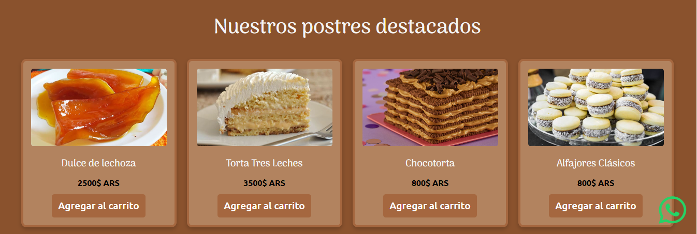
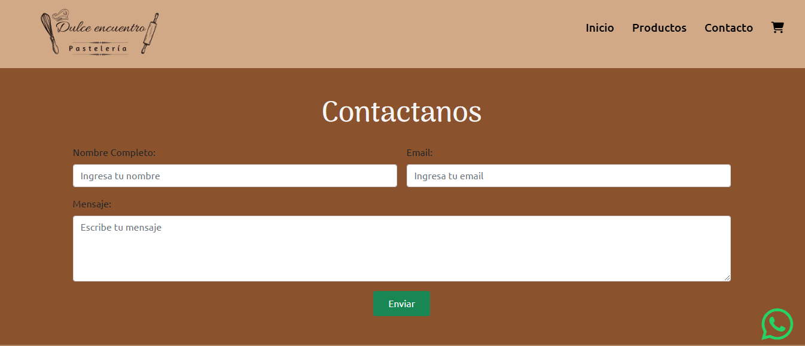

# Dulce Encuentro

**Dulce Encuentro** es una página web dedicada a la venta de postres argentinos y venezolanos. El objetivo del proyecto es proporcionar un espacio amigable y atractivo donde los usuarios puedan explorar y adquirir postres tradicionales de ambas culturas.

## Tecnologías utilizadas

Este proyecto fue desarrollado utilizando las siguientes tecnologías:

- **HTML**: Para estructurar el contenido de la página.
- **CSS**: Para dar estilo y diseño a la página, incluyendo responsividad.
- **JavaScript**: Para la interactividad y validación de formularios.

## Características principales

- **Galería de productos destacados**: Una sección que muestra algunos de los postres más populares.
- **Diseño responsive**: La página está optimizada para diferentes dispositivos, asegurando una experiencia de usuario óptima en computadoras, tabletas y teléfonos móviles.
- **Formulario de contacto**: Incluye validación para garantizar la correcta captura de datos.

## Estructura del proyecto

El proyecto está organizado de la siguiente manera:

```
DulceEncuentro/
├── index.html        # Archivo principal de la página
├── favicon           # Icono representativo de la página
├── assets/
│   ├── img/          # Imágenes utilizadas en el sitio
├── css/              # Archivos CSS para estilos
│   ├──               # estilos.css
├── js/
│   ├── index.js      # Manipulación del menú toggle
│   └── validacion.js # Validaciones del formulario en JavaScript
├── pages/            # Páginas adicionales del sitio
│   ├── carrito.html  # Página del carrito de compras
│   ├── contacto.html # Página de contacto
│   └── productos.html# Página de productos
└── README.md         # Documentación del proyecto
```

## Instalación y uso

1. Clona este repositorio en tu equipo:
   ```bash
   git clone [https://github.com/Gracimars/DulceEncuentro.git]
   ```
2. Abre el archivo `index.html` en tu navegador.

## Capturas de pantalla

### Vista de la galería de productos



### Formulario de contacto



## Futuras mejoras

- Integración con un backend para manejo de pedidos y usuarios.
- Agregar funcionalidad de carrito de compras.
- Incorporar métodos de pago en línea.

## Autor

Este proyecto fue desarrollado por Gracimar Pèrez Morgado. Si tienes preguntas o sugerencias, no dudes en contactarme.

---

© 2024 Dulce Encuentro. Todos los derechos reservados.
